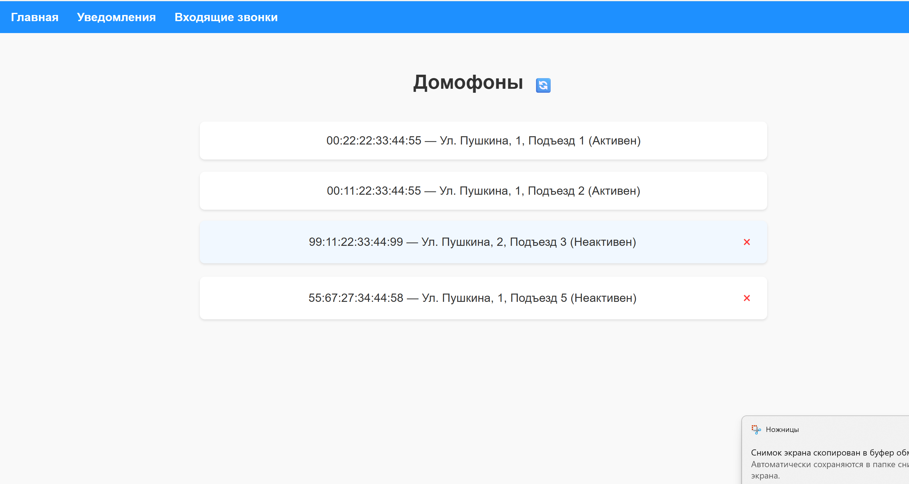
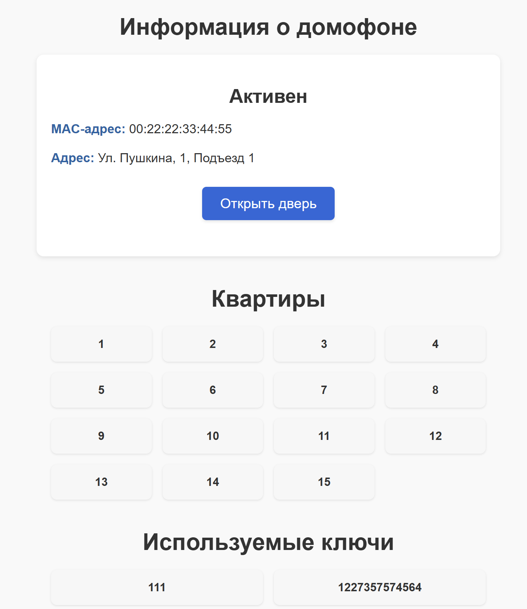
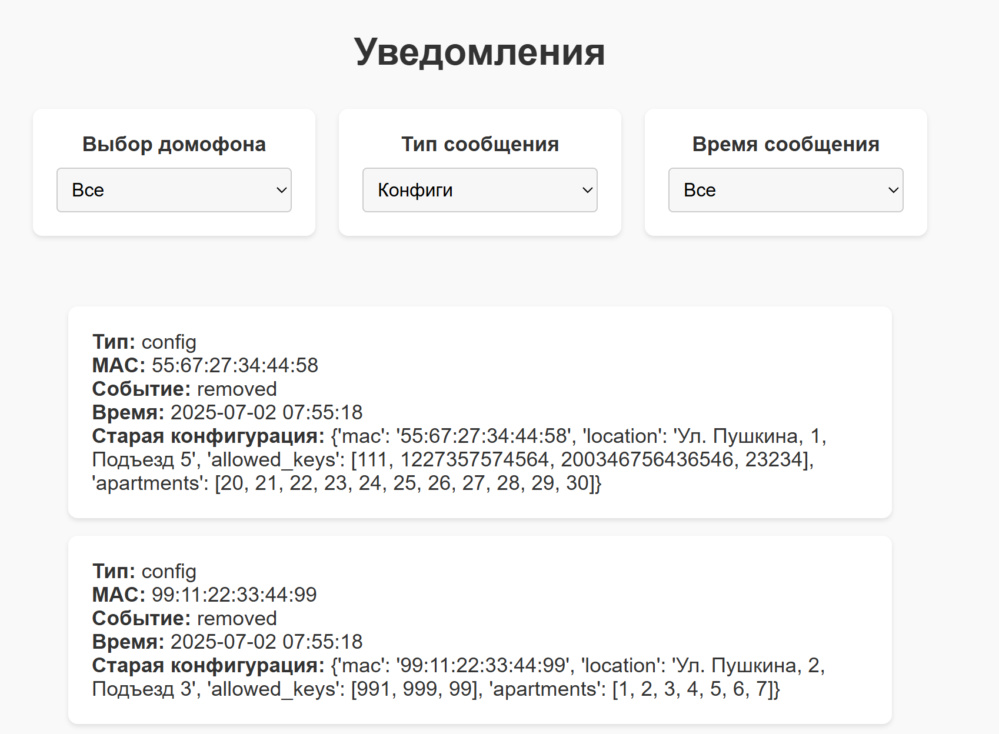
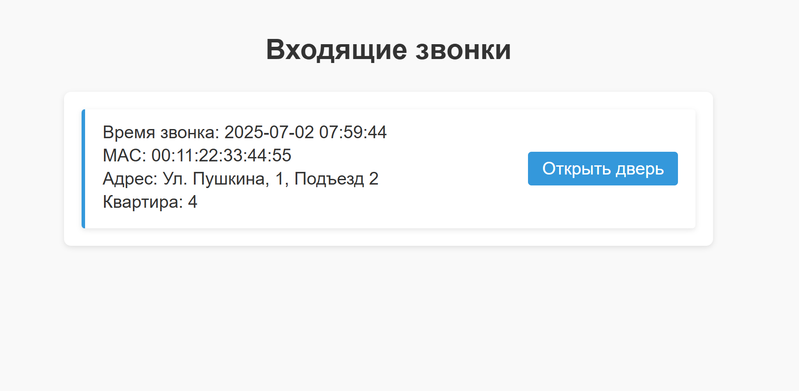

Основной проект, включающий микросервис домофонов: https://github.com/TiredGit/MQTT_intercoms_project . Запуск осуществляется через него

Микросервис уведомлений и управления:
Просмотр домофонов: активных и неактивных (неактивные - те, которые были отключены, но информация о них сохранилась). Информацию о неактивных домофонах можно удалить.
Реализовано сохранение приходящих из MQTT сообщений в Clickhouse, также возможен их просмотр с фильтрами типа уведомления, времени и мак-адреса.
Имеется возможность просмотра информации об конкретном домофоне, а также открытия двери через него.
Кроме того, через вкладку "Входящие звонки" возможно ответить на звонок, открыв дверь

Главная страница:

Страница домофона:

Страница уведомлений:

Страница входящих звонков:
